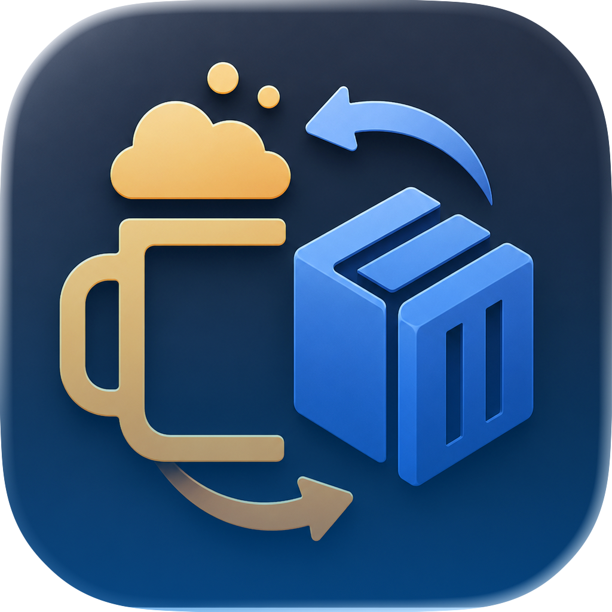
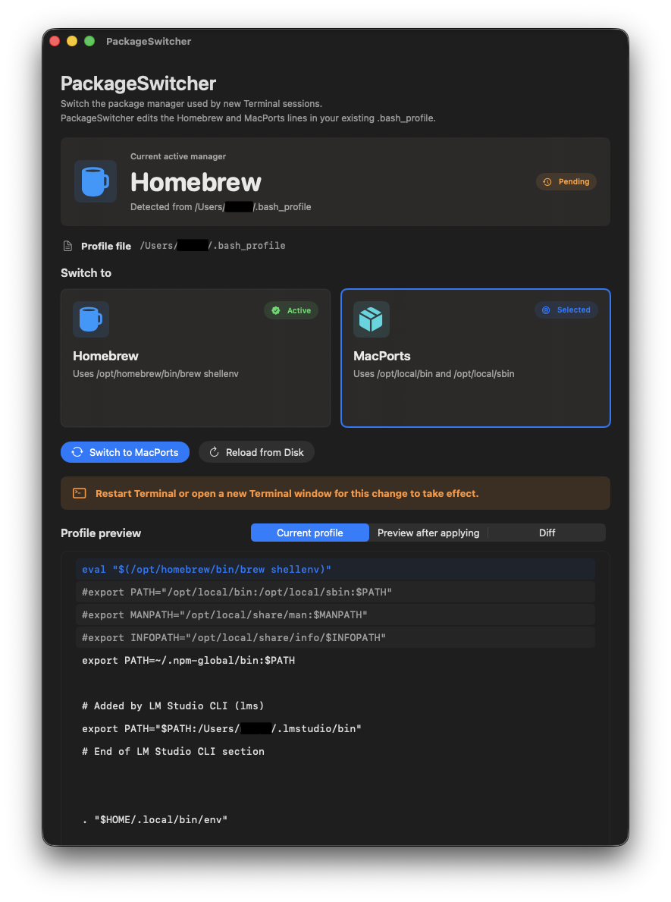
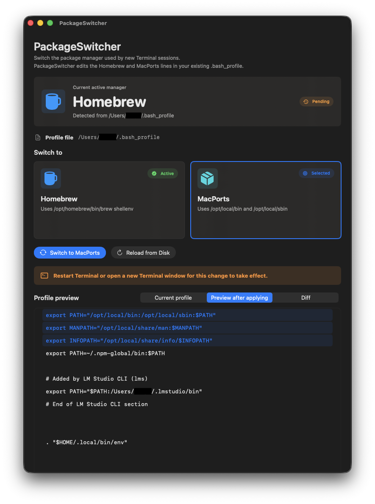
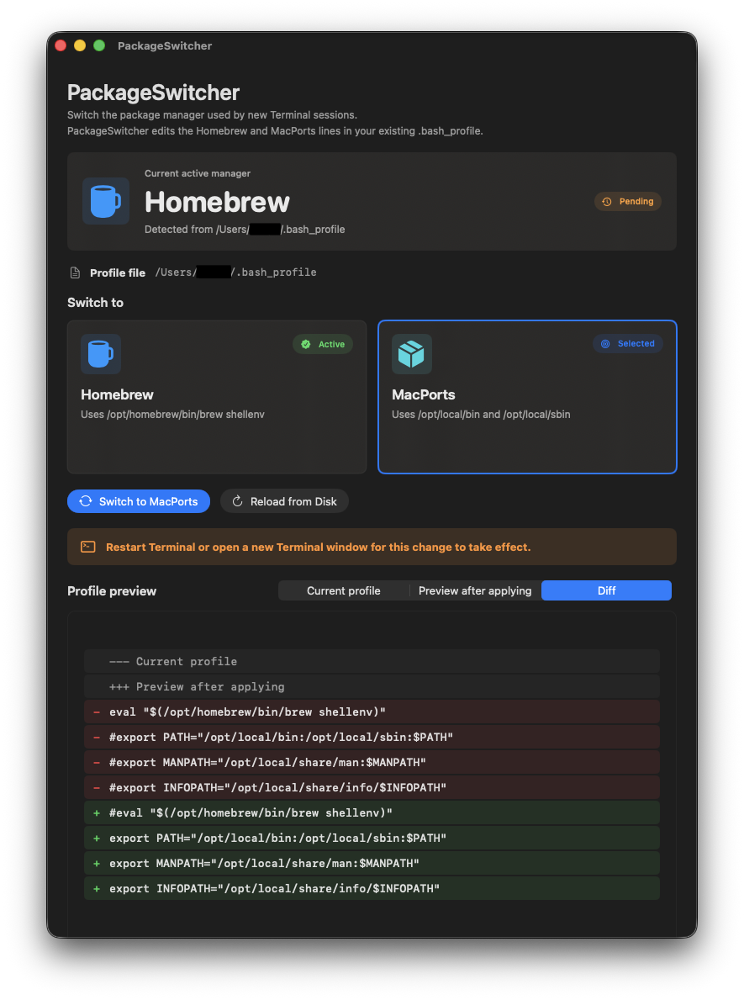

<table border="0" cellpadding="0" cellspacing="0" style="border-collapse: collapse; margin: 0; padding: 0;">
  <tr>
    <td valign="middle" style="border: 0; padding: 0 24px 0 0; margin: 0;">
      <h1 style="margin: 0 0 8px 0; padding: 0; border-bottom: 0;">PackageSwitcher</h1>
      <p style="margin: 0; padding: 0;">
        PackageSwitcher is a native macOS utility for switching the shell environment in your existing
        <code>.bash_profile</code> between Homebrew and MacPorts.
      </p>
    </td>
    <td width="96" align="right" valign="top" style="border: 0; padding: 12px 0 0 0; margin: 0;">
      
    </td>
  </tr>
</table>

## Overview

Package Switcher is designed for people who use Homebrew and MacPorts on the same Mac and want a clearer, safer way to choose which package manager takes precedence in new Terminal sessions.

Both package managers can coexist. When they provide commands with the same name, the version found earlier in `PATH` usually runs. Package Switcher makes the relevant profile lines visible, previews the result, and shows a diff before writing any changes.

## Is This Even a Good Idea?

MacPorts has some security advantages because it requires `sudo` before installing packages, while Homebrew offers some packages that are not available in MacPorts. I decided to complicate my life by using both package managers, and PackageSwitcher makes it easier to switch between them. I have used this workflow for over two years and found it useful. If you are reading this and think there is a better approach, critique is welcome. Maybe I will learn something!

## Why This Exists

- Homebrew and MacPorts can both be installed on one Mac.
- Each package manager adds directories to the shell environment.
- `PATH` order determines which copy of an overlapping command runs.
- Manual startup-file edits are easy to mistype or apply inconsistently.
- Package Switcher exposes the active state and the exact proposed changes.
- Each package manager has some packages which are unique.

## What It Does

- Targets the current user's `~/.bash_profile`.

- Detects the expected active Homebrew or MacPorts lines.

- Switches between the exact Homebrew and MacPorts profile blocks used by the app.

- Provides Current Profile, Preview After Applying, and Diff views.

- Preserves unrelated `.bash_profile` content.

- Creates a timestamped backup before writing:
  
  ```text
  .bash_profile.PackageSwitcherBackup-yyyyMMdd-HHmmss
  ```

- Writes the updated profile atomically.

- Warns when expected Homebrew or MacPorts installation paths are unavailable.

Package Switcher does not use managed block markers and does not modify `.zprofile`, `.zshrc`, or other shell startup files.

## What It Does Not Do

- Install Homebrew
- Install MacPorts
- Uninstall packages
- Migrate packages between package managers
- Merge Homebrew and MacPorts dependency trees
- Make both package managers share a package database
- Automatically configure zsh startup files

## Features

### Switching

- Switch between Homebrew and MacPorts
- Show the currently detected package manager
- Display the exact `.bash_profile` path being edited

### Review

- Current profile view
- Preview before applying
- Row-highlighted diff view
- Horizontal and vertical scrolling for long profile content

### Safety

- Preview and diff before writing
- Timestamped backup created before each switch
- Atomic profile writes
- Unrelated profile content retained

### macOS Experience

- Native SwiftUI interface
- Light and dark mode support
- Localized status, warning, error, success, and accessibility text
- Support link in the app and About window

## Installation

There is currently no packaged or notarized release documented in this repository. Build Package Switcher from source using Xcode.

## Usage

1. Launch Package Switcher.
2. Review the detected active package manager and profile path.
3. Select Homebrew or MacPorts.
4. Inspect **Preview After Applying** and **Diff**.
5. Apply the switch.
6. Open a new Terminal window, or restart Terminal, for the environment change to take effect.

## Safety and Recovery

Package Switcher edits shell startup configuration. Review the preview and diff before applying a change.

Before writing, the app saves the current `.bash_profile` in the same directory using a timestamped filename. To restore one manually:

```bash
cp ~/.bash_profile.PackageSwitcherBackup-YYYYMMDD-HHMMSS ~/.bash_profile
```

Replace the timestamp with the backup you want to restore. You can also make your own backup before early use:

```bash
cp ~/.bash_profile ~/.bash_profile.backup
```

Back up only the shell profile you actually use. Package Switcher itself edits `.bash_profile` only.

## Localization

Package Switcher currently ships with these localizations:

|                                                          |                                                                                         |
| -------------------------------------------------------- | --------------------------------------------------------------------------------------- |
| • English<br>• Arabic<br>• French<br>• German<br>• Hindi | • Japanese<br>• Korean<br>• Portuguese<br>• Simplified Chinese (`zh-Hans`)<br>• Spanish |

Arabic includes right-to-left interface support. Shell commands, paths, and environment variables remain left-to-right for readability and accuracy.

The app follows the language selected by macOS. Flags, if used as visual scanning aids in language-selection interfaces, should not be interpreted as claiming that a language belongs to one country or region.

## Screenshots

PackageSwitcher shows the current `.bash_profile`, a preview of what will be written, and a diff view so you can verify the exact changes before applying them.

### Current Profile



### Preview After Applying



### Diff View



## Troubleshooting

After switching, open a new Terminal window and inspect the effective environment:

```bash
echo $SHELL
echo $PATH | tr ':' '\n'
which brew
which port
brew --prefix
port version
```

Package Switcher expects:

- Homebrew at `/opt/homebrew/bin/brew`
- MacPorts directories at `/opt/local/bin` and `/opt/local/sbin`

Homebrew installations under `/usr/local` are not detected by the current switching logic.

## Building From Source

Requirements:

- macOS 14.3 or later
- Xcode with the macOS SDK

Build and run:

1. Open `PackageSwitcher.xcodeproj` in Xcode.
2. Select the **PackageSwitcher** scheme.
3. Select **My Mac** as the run destination.
4. Build and run with **Command-R**.

From the command line:

```bash
xcodebuild \
  -project PackageSwitcher.xcodeproj \
  -scheme PackageSwitcher \
  -configuration Debug \
  build
```

## Support

If Package Switcher saves you time or helps you manage a dual Homebrew/MacPorts setup, you can support development here:

☕ https://buymeacoffee.com/blackrockcity

## License

Package Switcher is licensed under the [GNU General Public License version 3](LICENSE).
